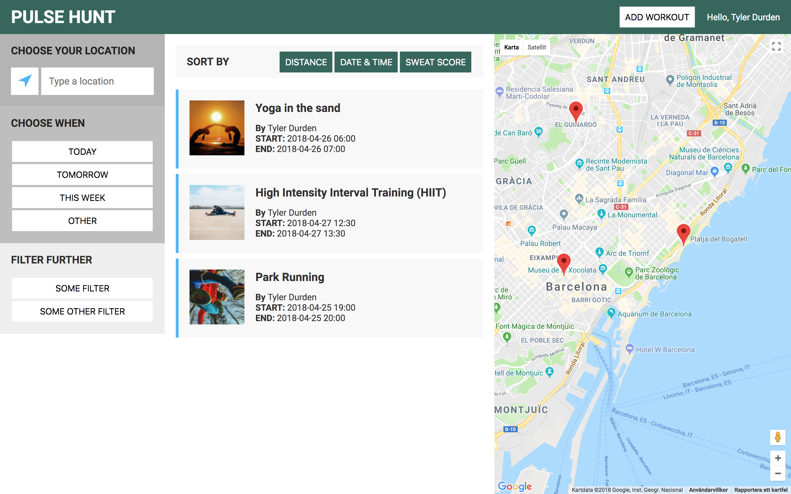
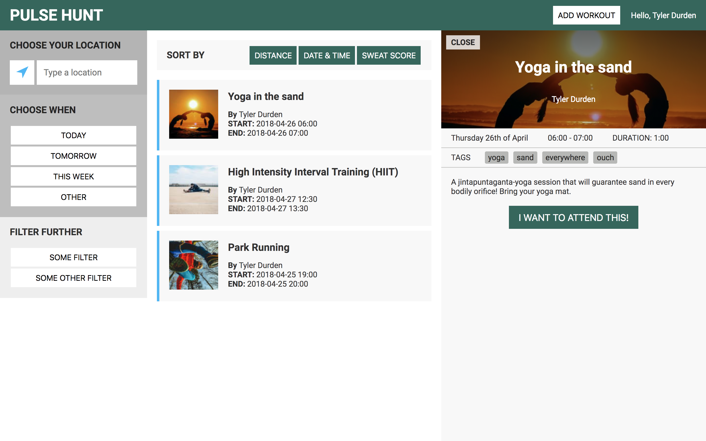
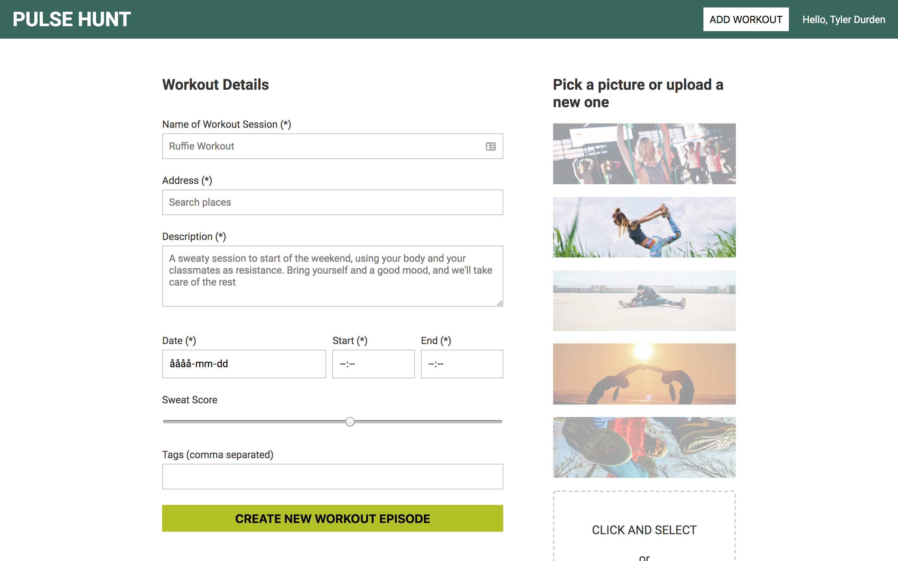

# Pulse Hunt (client/frontend)
Pulse Hunt is a market place where Indie Trainers can offer their workout sessions to users. The project was initiated as a one week solo project when attending [Codeworks](https://codeworks.me) Coding Bootcamp in Barcelona.

This is the client/frontend. The server/backend can be found [here](https://github.com/cherlin/pulsehunt-backend "Pulse Hunt backend")

## Screenshots

## Getting started

### Prerequisites
In order to run this frontend, you need [the corresponding backend](https://github.com/cherlin/pulsehunt-backend "Pulse Hunt backend"). Go to the repo, read its prerequisites and get back here once you have it up and running.

### Installing
* Clone this repo: `git clone https://github.com/cherlin/pulsehunt-frontend`
* Move into the folder: `cd pulsehunt-frontend``
* Install all dependencies: `npm install` or `yarn install`
* To start the frontend, run `npm start` or `yarn start`. This activates the React start script and will display the frontend. (You will need to have the backend live in order to test out any functionality.)

## Tech Stack
* [React](https://reactjs.org)
* [Redux](https://redux.js.org)

## Upcoming
* GraphQL implementation.
* Authentication using OAuth and JWT.
* Mobile responsiveness.
* Create a landing page.
* Add profile pages for users and trainers.
* Management features for trainers.

## Feedback
If you have any feedback, send me an [email](mailto:christofer.herlin@gmail.com) or open an issue on the repo.

## Collaboration
All improvements welcome! Open a pull request and let's discuss.